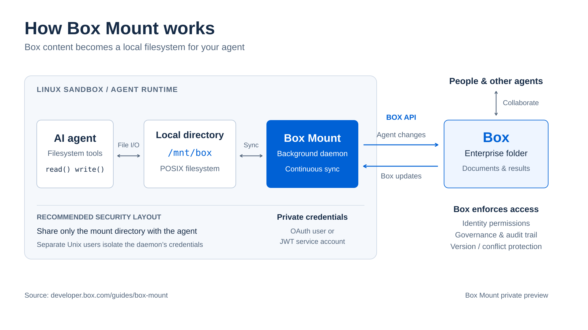
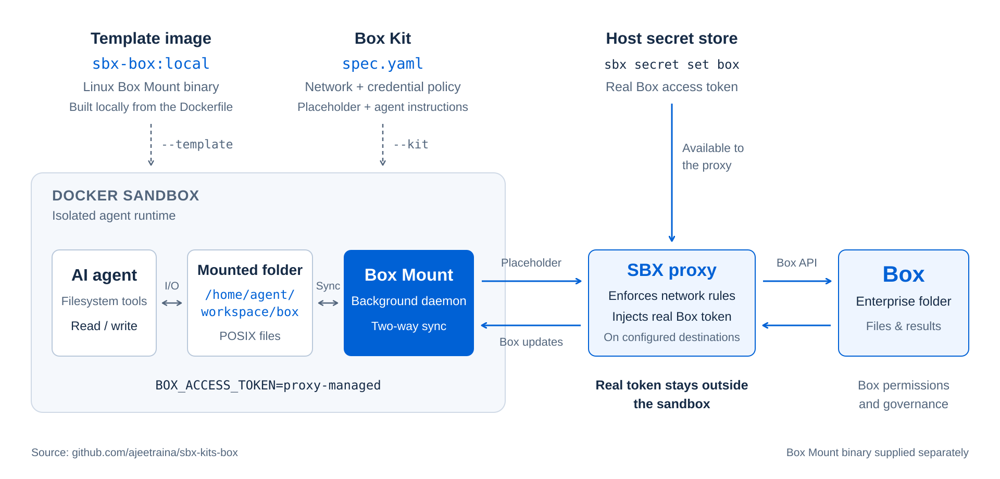

# Box Mount Contract Review with Docker Sandboxes



[Box Mount](https://developer.box.com/guides/box-mount) gives agents a filesystem backed by a Box folder. Tools can read documents and write results using ordinary file paths; a background process synchronizes changes in both directions, using the authenticated identity's Box permissions.

[Docker Sandboxes](https://docs.docker.com/ai/sandboxes/) supplies the execution environment: an isolated microVM with its own filesystem and tools, managed through the `sbx` CLI.

This demo brings them together: an agent discovers a synthetic MSA and approved legal playbook, compares them, and saves a review memo back to Box. Its agent loop and filesystem tools run inside the sandbox; the model runs on OpenAI.

## Prerequisites

- An Ubuntu 24.04+ x86_64 host with KVM available and a sudo-capable account.
- Node.js 20+ and npm.
- A new, empty Box folder and its ID—the number at the end of its Box URL.
- A Box Developer Token and an OpenAI API key.
- The Linux x86_64 Box Mount binary from the [Box Mount preview](https://developer.box.com/guides/box-mount).

The steps below target Ubuntu, including a DigitalOcean droplet with nested virtualization. Environment checks and ARM instructions are in the [appendix](#appendix).

## Setup

### 1. Install Docker and Sandboxes

Run these commands on your Ubuntu host:

```bash
curl -fsSL https://get.docker.com | sudo SBX=1 sh
sudo usermod -aG kvm,docker "$USER"
```

Reconnect over SSH to apply the group memberships, then sign in:

```bash
sbx login
```

Docker Engine builds the template image; `sbx` creates and manages the sandbox. Docker Desktop is not required on this host. See [Docker's installation guide](https://docs.docker.com/ai/sandboxes/install/) for details.

### 2. Configure the project

```bash
git clone https://github.com/box-community/docker-box-mount.git
cd docker-box-mount
npm install
cp .env.example .env
chmod 600 .env
editor .env
```

Fill in `BOX_ACCESS_TOKEN`, `BOX_FOLDER_ID`, and `OPENAI_API_KEY`. All three are required; missing values stop the command before it creates a sandbox.

Optionally set `OPENAI_MODEL` in `.env`. To assign the resulting memo to a person, set `BOX_REVIEWER_USER_ID` to their Box user ID; otherwise, task assignment is skipped.

### 3. Install the Box kit

Allow the [Box Kit](https://github.com/ajeetraina/sbx-kits-box) as a trusted source on a fresh host:

```bash
sbx settings set kit.allowedSources '["docker.io/","github.com/ajeetraina/sbx-kits-box"]'
```

If you already customized `kit.allowedSources`, add this repository to your existing list instead of replacing it.

Then install using your extracted Linux Box Mount executable:

```bash
npm run kit:install -- /path/to/box-mount
```

The installer checks the binary's architecture, fetches the upstream kit's default branch, and builds and loads `sbx-box:local` using its build script. It handles the temporary checkout and file layout; nothing is published, and your original binary is left untouched.

The **template** supplies the private executable; the **kit** supplies network rules and credential injection. The demo attaches the kit directly from GitHub when creating a sandbox—no local kit checkout to maintain. Unlike kits that install public SDKs, Box Mount's private-preview binary still requires this one-time local build. [Installation details](#kit-installation-details) are in the appendix.

### 4. Register sandbox credentials

```bash
npm run setup
```

This reads both tokens from `.env` and registers them with `sbx` through stdin—no second paste, token-bearing command arguments, or token logs. It creates or replaces the host-level `box` and `openai` service secrets, just like the manual `sbx secret set` commands. No sandbox is created by this step.

The host scripts use the Box token for account checks and optional task assignment. Inside the sandbox, Docker's [credential proxy](https://docs.docker.com/ai/sandboxes/configuration/credentials/) replaces placeholder credentials on matching outbound requests. Seeing `proxy-managed` in a sandbox environment variable is expected.

The pieces you just configured work together as shown below: the **template** supplies the Box Mount executable, the **kit** supplies network rules and credential mappings, and the host-side **proxy** injects the stored Box token on matching requests. The kit contains no real token.



The diagram shows the Box credential path, not every shared file. This demo also shares the project directory, including `.env`; proxy injection does not hide credentials in shared files. The review tools cannot read `.env`, but arbitrary sandbox code may be able to. See [tokens and authentication](#tokens-and-authentication) before broadening agent access.

## Run

Run these steps in order from the project directory. Finish with teardown before starting another session; the commands share the sandbox name `box-contract-review`.

### 1. Validate your setup

```bash
npm run doctor
```

This checks the local configuration and fixtures, Box account and folder access, and whether a temporary sandbox can execute Box Mount. It also checks OpenAI authentication and access to the selected model.

### 2. Seed the Box folder

```bash
npm run seed
```

This mounts your Box folder in a temporary sandbox and copies the sample files into the mount. Box Mount uploads them to Box; the command then unmounts and removes that sandbox.

That upload illustrates Box Mount's core idea: work with ordinary files and let a background daemon handle Box API calls. While mounted, synchronization runs both ways—local writes upload to Box, and changes in Box flow back to the local directory under the authenticated identity's Box permissions.

Your Box folder now contains:

```text
Incoming/Acme-MSA.docx
Playbook/approved-contract-playbook.md
Reviewed/
```

### 3. Run the review

```bash
npm run demo
```

The demo creates a sandbox from the local template and the upstream GitHub kit, then mounts your Box folder at `/home/agent/workspace/box`.

The agent receives a goal: **review the incoming contract against the approved playbook and save the findings**. It chooses its own sequence of `list_files`, `read_file`, and `write_file` calls, observes each result, and can correct errors or revise its report. DOCX text extraction is handled by `read_file`; source documents are not preloaded into the prompt.

All filesystem actions execute inside Docker Sandbox against the Box Mount directory. Text returned by reads is sent to OpenAI for analysis. Tool handlers restrict reads to Markdown/DOCX sources in `Incoming/` and `Playbook/`, plus the review output; writes are limited to `Reviewed/Acme-MSA-review.md`. The agent has no shell or credential-reading tool. These are application-enforced tool permissions, in addition to the sandbox's isolation and Box's access controls.

After the runner finishes, the terminal prints its tool-action trace without document contents or model reasoning. Completion requires this run to read both sources, write the review, and read back the latest saved version. The sequence is model-selected, not a fixed script.

The reviewer writes `Reviewed/Acme-MSA-review.md` into the mount for synchronization back to Box. Open that file in Box to inspect the findings. If a reviewer ID is configured, the demo attempts to assign a Box review task on the memo.

### 4. Explore the live workspace

The sandbox stays running after the review. Check the mount:

```bash
npm run status
```

You can also open a shell:

```bash
sbx exec -it box-contract-review -- bash
ls /home/agent/workspace/box
```

Changes in Box flow into this directory, and writes in the directory flow back to Box while sync is active. This is what lets an agent work with familiar filesystem tools while people continue working in Box.

### 5. Clean up

Exit the sandbox shell, then run on the host:

```bash
npm run teardown
```

This requests a final sync and unmount, then removes the sandbox and local session state. Successfully synchronized files remain in Box. Use this command when finished; the application does not enforce an automatic sandbox expiry.

The included contract and generated review are synthetic demonstrations, not legal advice.

## Appendix

### Agent limits and failures

The runner stops after 20 model turns, 30 tool calls, or four minutes, whichever comes first. Each API request has a 60-second timeout and an 8,192-output-token cap. Files are limited to 2 MiB, returned document text and saved reviews to 128 KiB, and directory listings to 200 entries. Paths are validated; traversal, symlinks, hard links, and writes outside the designated review file are rejected.

Recoverable tool errors are returned to the model so it can choose another action. API failures, exhausted limits, or an unverified result fail the demo explicitly, without a substitute reviewer. A failed run may already have written a partial review into the synced folder; inspect any such file before using it. Read-back verifies the local saved file, not Box synchronization or legal correctness. Qualified legal review is still required.

### KVM and Ubuntu checks

```bash
ls -l /dev/kvm
npm run check:ubuntu
```

If `/dev/kvm` is absent, check kernel-module loading and nested virtualization support with your provider. If access is denied, confirm your account belongs to the `kvm` group and reconnect after changing membership. For additional diagnostics, install `cpu-checker` and run `kvm-ok`.

### Missing utilities and ARM hosts

If the build reports `file: command not found`:

```bash
sudo apt-get update
sudo apt-get install -y file
```

Install `curl`, `git`, or `ca-certificates` only if your image lacks them. For an ARM host, pass the extracted Linux arm64 executable to the same `npm run kit:install -- /path/to/box-mount` command. The installer selects the layout automatically and rejects a mismatched binary before building.

### Tokens and authentication

Box Developer Tokens expire after approximately 60 minutes and cannot refresh themselves. Whenever either token changes, update it in `.env`, run `npm run setup`, and recreate the demo sandbox. Editing `.env` alone does not update the secret store. Setup validates both tokens are present before registering them; if one registration fails, fix the reported issue and rerun the command to register both again. Registration stores credentials; `npm run doctor` checks whether they work.

An OpenAI error that names `proxy-managed` means the placeholder reached the API. Check the stored OpenAI secret and the request's use of Docker's credential proxy. An unavailable-model error should name your configured `OPENAI_MODEL`.

On headless Linux without a keyring, Docker stores secrets under `~/.config/com.docker.sandboxes` by default. Also keep `.env` private: this demo shares the project directory with the sandbox, so proxy injection alone does not hide secrets saved in that shared directory.

### Sync and template troubleshooting

Check `sbx template ls` if the sandbox cannot find `sbx-box:local`. Check `sbx policy log box-contract-review` for blocked network requests while the sandbox exists. Edit files in place inside the mount; save-by-replacement can affect Box version history.

If `sbx` rejects the GitHub source, check `sbx settings get kit.allowedSources` and the trusted-source step above. Do not use a wildcard to allow every publisher. If your organization manages this setting, ask its administrator to permit the upstream repository.

See the [upstream kit documentation](https://github.com/ajeetraina/sbx-kits-box#readme) for build, publishing, and kit-specific troubleshooting. Keep the preview binary and images containing it private.

### Updating or migrating the kit

Both the installer and sandbox launcher use the upstream repository's default branch without a revision pin. To refresh the template, rerun `npm run kit:install -- /path/to/box-mount` and recreate the sandbox. This rebuilds and replaces the local `sbx-box:local` template; it does not recreate existing sandboxes. The template is not automatically rebuilt when the upstream kit changes.

If you previously used `kit/box-mount/` or a separate upstream checkout, you can pass the binary from that location to the installer. No existing checkout is modified or deleted. The old `kit/` directory remains ignored by Git to protect leftover private binaries.

### Kit installation details

`npm run kit:install` requires Git, `file`, a running Docker Engine, and an authenticated `sbx` installation. Supply an extracted Linux executable, not a `.tar.gz` archive or a macOS binary. It does not need Box or OpenAI credentials and does not read `.env`.

The installer shallow-clones the upstream default branch into a private temporary directory, copies the binary into the appropriate architecture directory, and runs the upstream `scripts/build-and-load.sh`. That script builds the template, saves an image archive, and loads it into the sandbox runtime. The installer removes its temporary checkout and archive after success or a reported failure. The template remains in Docker and SBX; keep those image stores private.

If installation fails, fix the reported error and rerun the same command; there is no persistent checkout to repair. See the [upstream build instructions](https://github.com/ajeetraina/sbx-kits-box#quick-start-local-only) for manual installation. Sandbox creation also requires GitHub access and the [trusted-source policy](https://docs.docker.com/ai/sandboxes/customize/use-kits/#restrict-kit-sources) configured above.
